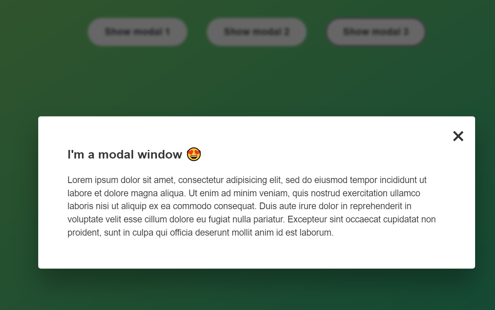

# modal-window Project
a modal window project to practice DOM API's keyboard events like (keydown, keypress, and keyup)
- click on any button between three buttons to open the modal window.
- you can click on the X button to close the modal.
- click anywhere to close the modal.
- use Escape key to close the modal.

